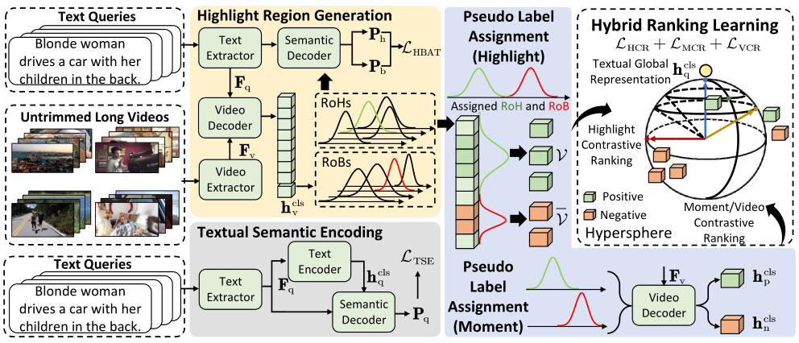
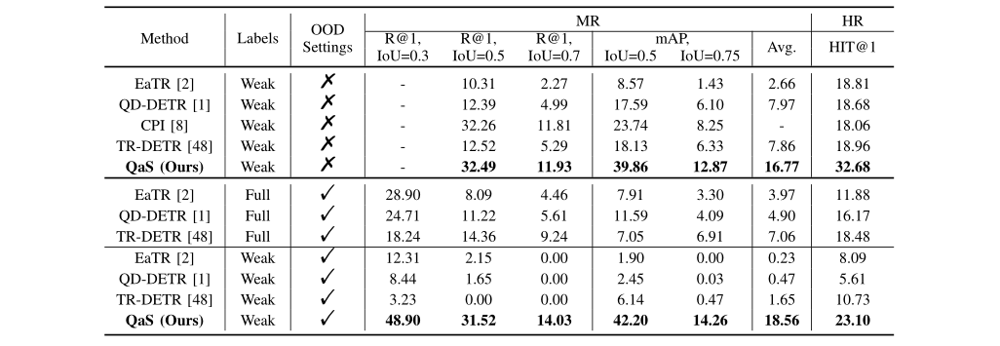
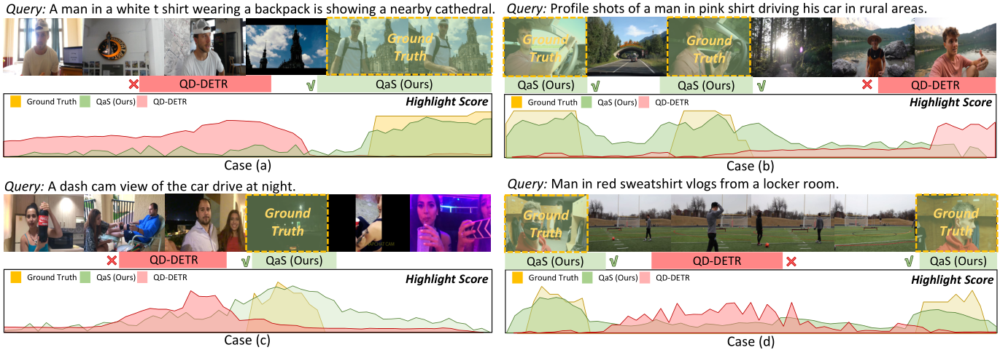

# Introduction
PyTorch implementation for paper:

Query as Supervision: Towards Low-Cost and Robust Video Moment and Highlight Retrieval



# Environments
* **python 3.9**
* **numpy 1.26.1**
* **pytorch 1.13.1**
* **torchvision 0.14.1**
* **tqdm 4.66.1**
* **nltk 3.8.1**
* **cuda 12.1**

# Data Preparation
<!-- According to the double-blind review regulations of SIGIR2024, we do not provide a cloud storage link.  
The visual features of the QVHighlights dataset can be downloaded from the official repository of the previous works, such as Moment-DETR, QD-DETR, or EaTR.   -->

You can download visual features of the QVHighlights dataset from the official repository of the previous works, such as Moment-DETR, QD-DETR, or EaTR.  
The pre-trained weights can be downloaded from [Google Drive](https://drive.google.com/file/d/1WotkhoiV8K6m2xdzKVisefYuSP3Xvv1J/view?usp=sharing).  

For now, we provide the data splits and the training config file on QVHighlights datasets for review.  
The pre-trained weights and configs of other datasets will be released after the paper is published.  

# Training and Evaluation

## Training
Run the following scripts to train `QaS` on the QVHighlights dataset.

```
bash qas/scripts/train.sh
```

## Evaluation

```
bash qas/scripts/inference.sh results/{direc}/model_best.ckpt 'val'
bash qas/scripts/inference.sh results/{direc}/model_best.ckpt 'test'
```

where `direc` is the path to the saved checkpoint. .

# Model Performance 

## Moment Retrieval and Highlight Retrieval performance

**On QVHighlights Dataset**



**Visualizations**


